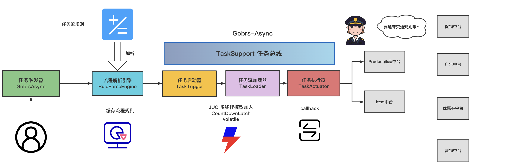

## 异步任务流程编排

### 一.  概述

在请求调用各大中台数据时，难免会出现多个中台数据互相依赖的情况，现实开发中会遇到如下场景。

1. 客户端请求服务端接口，该接口需要调用其他N个微服务的接口

   譬如：请求我的购物车，那么就需要去调用用户的rpc、商品详情的rpc、库存rpc、优惠券等等好多个服务。同时，这些服务还有相互依赖关系，譬如必须先拿到商品id后，才能去库存rpc服务请求库存信息。 最终全部获取完毕后，或超时了，就汇总结果，返回给客户端

2. 并行执行N个任务，后续根据这1-N个任务的执行结果来决定是否继续执行下一个任务

   - 如用户可以通过邮箱、手机号、用户名登录，登录接口只有一个，那么当用户发起登录请求后，我们需要并行根据邮箱、手机号、用户名来同时查数据库，只要有一个成功了，都算成功，就可以继续执行下一步。而不是先试邮箱能否成功、再试手机号……
   - 再如某接口限制了每个批次的传参数量，每次最多查询10个商品的信息，我有45个商品需要查询，就可以分5堆并行去查询，后续就是统计这5堆的查询结果。就看你是否强制要求全部查成功，还是不管有几堆查成功都给客户做返回
   - 再如某个接口，有5个前置任务需要处理。其中有3个是必须要执行完毕才能执行后续的，另外2个是非强制的，只要这3个执行完就可以进行下一步，到时另外2个如果成功了就有值，如果还没执行完，就是默认值。

3. 需要进行线程隔离的多批次任务

   如多组任务， 各组任务之间彼此不相关，每组都需要一个独立的线程池，每组都是独立的一套执行单元的组合。有点类似于hystrix的线程池隔离策略。

4. 单机工作流任务编排

5. 其他有顺序编排的需求

### 二.  技术原理

### 三.  开发说明

### 四.  参考资料 
