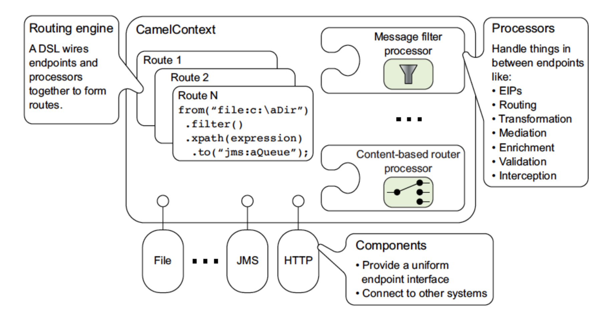
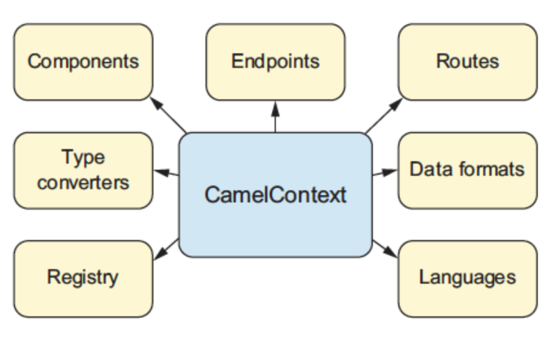
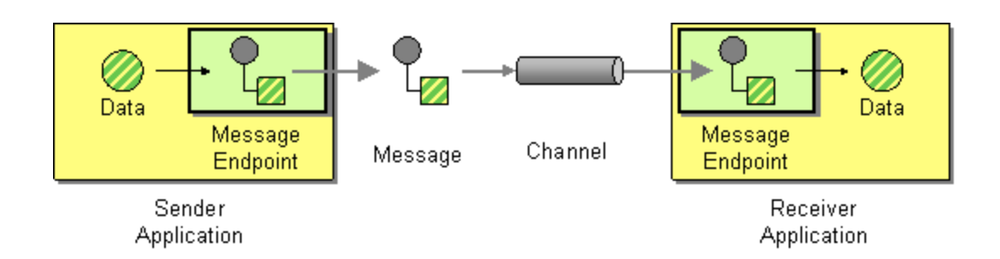
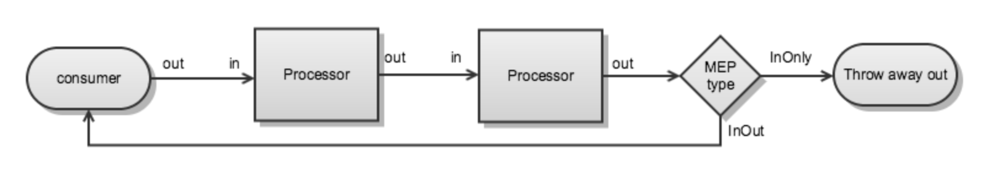

## Apache Camel 说明

### 一.  概述

Apache Camel 是一个非常流行的企业级Java集成框架。Camel 包含一组 Java API，可以在不同的计算机系统之间集成和处理数据，也可以将 Camel 视为Java的管道工具包，就像真正的管道一样，Camel 从一个点获取数据，并将其通过管道传输到另一个点。在此过程中，数据可以更改、转换或通过其他管道发送。

### 二.  技术原理

Apache Camel 的架构如下



#### [CamelContext](https://blog.csdn.net/qq_38316721/article/details/116296801)

Apache Camel的运行的核心，即 Camel 容器，它将所有的元素，例如：Routes、Endpoints、Components等组合在一起。




#### [Route](https://www.jianshu.com/p/d6591f5c1de4)

Camel中最基本的概念。Message 从消费者Endpoints进入路由，通过定义的[DSL](https://camel.apache.org/manual/dsl.html)来指挥Message一步一步的移动。Camel 中每一条路由都有一个唯一的标识符，唯一的一个Input Message Source。

Camel中，RouteBuilder 通过使用 [DSL](https://camel.apache.org/manual/dsl.html) 来构建路由。

```java
public class MyRouteBuilder extends RouteBuilder {
    public void configure() throws Exception {}
}
```

#### [Endpoint](https://blog.51cto.com/u_15080016/4220816)

在已经编排好的路由规则中，和其它系统进行通信的设定点，即消息发送和接收的始末点（某个资源的位置）。Camel 中可以通过 DSL （例如：file:data/inbox?delay=5000）来定义 Endpoint。



[Exchange](https://juejin.cn/post/7116743079918305310)

Exchange是当前发生在你的Camel路线中的通信或对话，消息是Exchange的一部分。

#### [Processor](https://blog.csdn.net/qq_38316721/article/details/116158182)

Processor 是 Camel 的核心概念，它是一个可以对Exchange进行接收并处理的节点。Camel核心包和各个Plugin组件都提供了很多Processor的实现，开发人员也可以通过实现org.apache.camel.Processor接口自定义处理器（后者是通常做法）。**Processor中最主要的工作是进行业务数据格式的转换和中间数据的临时存储**。这样做是因为Processor处理器是Camel编排的路由中，主要进行Exchange输入输出消息交换的地方。



#### Component

Camel的内置组件，(用户也可以按照Camel的接口约定，来定义自己的component),用以提供对某种协议的资源访问的支持。例如：file://xxxx，就是一个Component，其提供了对本地文件系统访问的支持。

### 三.  开发说明

基于Springboot进行开发，本例使用Springboot版本2.7.x，Camel版本3.8.0，Jdk版本17（必须>=11）

#### 1. 引入依赖

```xml
<dependencyManagement>
		<dependencies>
			<dependency>
				<groupId>org.apache.camel.springboot</groupId>
				<artifactId>camel-spring-boot-bom</artifactId>
				<version>${camel.version}</version>
				<type>pom</type>
				<scope>import</scope>
			</dependency>
		</dependencies>
</dependencyManagement>
<dependencies> 
  	<dependency> 
        <groupId>org.apache.camel.springboot</groupId>
        <artifactId>camel-spring-boot-starter</artifactId> 
    </dependency>
    <dependency> 
        <groupId>org.apache.camel.springboot</groupId>
        <artifactId>camel-其他依赖包</artifactId> 
    </dependency
</dependencies>
```


### 四.  参考资料 

- https://zhuanlan.zhihu.com/p/85985527
- https://camel.apache.org/docs/
- https://github.com/apache/camel-spring-boot-examples/blob/main/spring-boot/pom.xml
