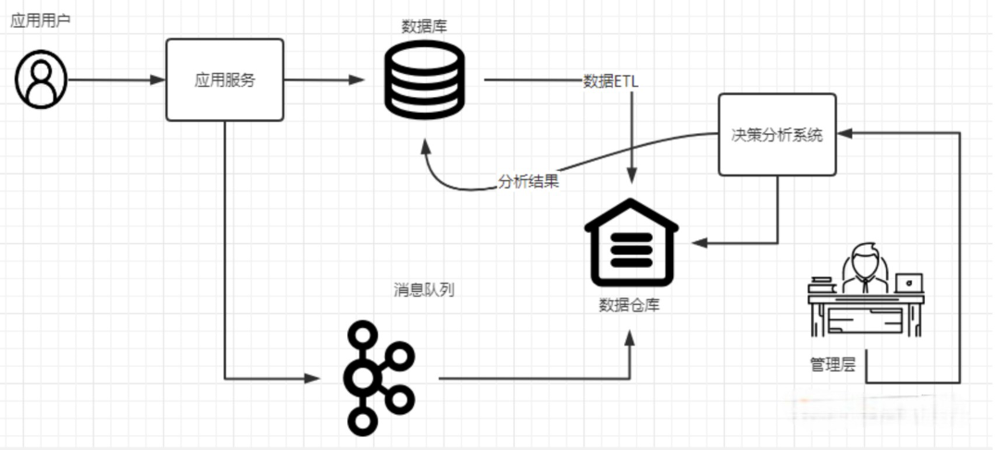

## ClickHouse 列式数据库

### 一. 概述

ClickHouse是一个用于联机分析(OLAP)的列式数据库管理系统(DBMS)。

- OLTP（on-line transaction processing）联机事务处理：通常指的是面向传统应用服务的关系型数据库，用户通过web界面操作实时“增删改查”数据库里面的数据。包含核心的基本的事务处理逻辑，用户对于性能的要求很高，用户点击界面之后，响应时间最低要求在5秒之内（通常3秒以内），同时需要支持比较高的用户并发度。OLTP的数据操作通常面向的是1条或几条少量数据，比如：用户下单操作该用户的购物车、支付记录、积分记录等少量数据。
- OLAP（On-Line Analytical Processing）联机分析处理：面向的应用主要是执行复杂的数据分析操作，侧重于决策支撑，通过图形报表展现直观易动的数据分析结果。对于响应时间的要求相对宽松，数据分析过程通常不支持用户高并发，但数据分析的结果支持用户的高并发访问。OLAP面向的通常是批量数据操作，数据按批次进行导入、分析等操作，OLAP系统通常结合ETL(抽取（extract）、转换（transform）、加载（load）)系统进行使用。

OLTP侧重于保存及变更数据的当前状态，而数据仓库侧重于保存数据的历史存档。

数据仓库的特点：

- 关注于记录数据变化的过程，而不是数据当前的状态。
- 读多写少
- 大宽表
- 数据批量操作，不更新或很少更新
- 不支持事务

二. 应用场景



### 三. 安装

- https://clickhouse.com/docs/zh/getting-started/install

- https://zimug.blog.csdn.net/article/details/125177075

### 三. 用户权限

- https://zimug.blog.csdn.net/article/details/125230802

```sql
-- 创建用户
create user root identified  by 'iamdante';
-- 授权
GRANT SHOW, SELECT, INSERT, ALTER, CREATE, DROP, UNDROP TABLE, TRUNCATE, OPTIMIZE, BACKUP, KILL QUERY, KILL TRANSACTION, MOVE PARTITION BETWEEN SHARDS, ACCESS MANAGEMENT, SYSTEM, dictGet, INTROSPECTION, SOURCES, CLUSTER ON *.* TO root WITH GRANT OPTION;
```

### 四. 基础数据类型

```sql
-- 获取版本的所有支持的数据类型
SELECT * FROM system.data_type_families;


-- Float32、Float64无法满足计算精度的要求，我们就需要使用Decimal数据类
SELECT
		toDecimal64(2, 3) AS x,   --数值为2，精度为3，所以2.000
    toTypeName(x) AS xtype,
    toDecimal32(2, 2) AS y,   --数值为2，精度为2，所以2.00
    toTypeName(y) as ytype,
    x + y AS a,  --2.000 + 2.00,加减法取最大精度。所以4.000
    toTypeName(a) AS atype,
    x * y AS b,  --2.000*2.00,乘法的精度值相加（2+3=5）。所以4.00000
    toTypeName(b) AS btype,
    x / y AS c, --2.000/2.00，被除数2.000精度是3，结果精度等于被除数精度。所以1.000
    toTypeName(c) AS ctype;

```


### 五. 常见问题

- 删除超过50G的大表

  创建<clickhouse-path>/flags/force_drop_table并授权

  ```bash
  touch /clickhouse/flags/force_drop_table
  
  -- 下面的命令可选
  chown clickhouse:clickhouse /clickhouse/flags/force_drop_table
  chmod 666 /clickhouse/flags/force_drop_table
  ```

  

### 八. 参考资料

- https://clickhouse.com/docs/zh
- https://juejin.cn/post/6939023230833262622
- https://blog.csdn.net/hanxiaotongtong/category_11854147.html