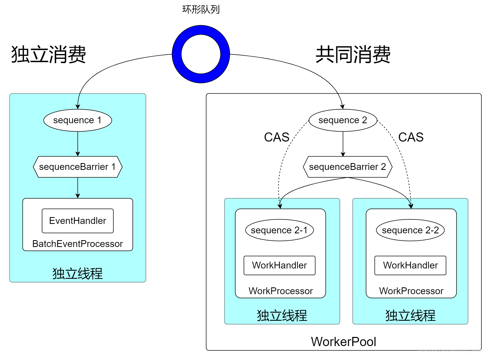

## Disruptor 内部消息队列

### 一.  概述

### 二.  技术原理

#### 2. 消费模式

disruptor事件的消费模式，包括独立消费和共同消费两种。

### 三.  开发说明

### 四. 其他实现

- Guava - EventBus（https://juejin.cn/post/6864940197269667853）
- Spring Event（https://www.baeldung.com/spring-events、https://developer.aliyun.com/article/829271）

### 五.  参考资料 

- https://www.cnblogs.com/bolingcavalry/p/15328374.html
- https://blog.csdn.net/boling_cavalry/article/details/117185656
