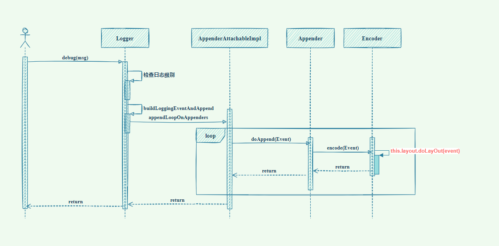

## 日志脱敏

### 一.  概述

我们开发的程序迟早有一天都会上线到生产环境运行，但是没有人能保证自己的代码100%不出BUG（别抬扛，真没BUG是代码写的少）当我们线上出BUG之后，最常见的定位问题方法就是排查日志文件，所以我们一般都会在开发程序时，在适当的位置输出一些日志信息。并且有一些日志并不是只打印一些业务字段，可能会将整个对象输出到日志中。

比如这样：

```java
log.info("客户信息：{}",JSON.toJSONString(customer));
```

从代码的角度来说，不太严格的话，如果这个`customer`对象不是特别大的话，倒也没有多大的问题。但是咱们换个角度，从信息安全的角度来说，这会直接将用户的所有信息都打印在日志中。

假设某一天，开发小哥或者运维小哥因为某些不太建议的操作，恶意从日志中获取用户的信息，比如用户的手机号，邮箱，身份证号，家庭住址。。。。如果你们公司是一家金融类公司，直接获取到一些富豪客户的信息，然后去做一些非法交易，后果很严重。

### 二.  技术原理

给Logback配置上脱敏规则，将脱敏规则添加到Logback的`appender`中。




### 三.  开发说明

1. 使用`conversionRule`标签，继承`MessageConverter`（需要修改代码，不符合开闭原则）
2. 书写一个脱敏工具类，在打印日志的时候对特定特字段进行脱敏返回（需要在日志方法的参数进行脱敏，对原生日志有入侵行为）
3. 自定义脱敏组件（Logback 的 PatternLayout）

### 四.  参考资料 

- https://www.heiz123.com/2022/03/560/
- https://mp.weixin.qq.com/s/NFPvVGIRvNz7Wgws8nwBNA
- https://cloud.tencent.com/developer/article/1520192
