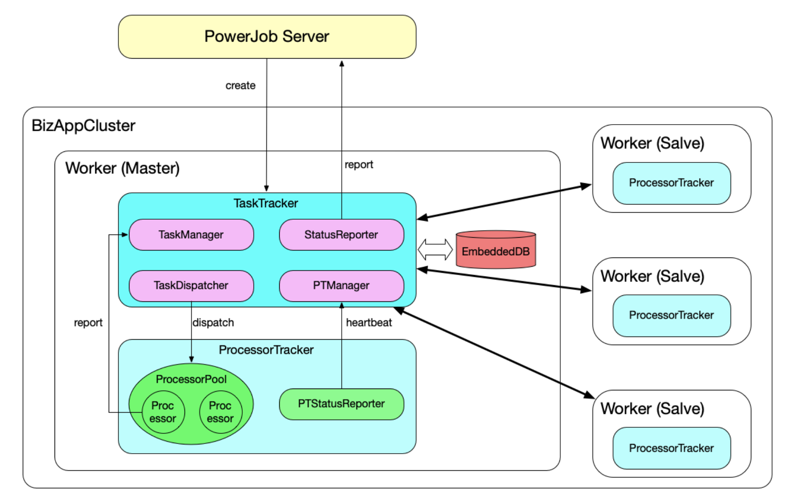

## PowerJob

### 一.  概述
PowerJob（原OhMyScheduler）是全新一代分布式任务调度与计算框架。

适用场景
● 有定时执行需求的业务场景：如每天凌晨全量同步数据、生成业务报表、未支付订单超时取消等。
● 有需要全部机器一同执行的业务场景：如使用广播执行模式清理集群日志。
● 有需要分布式处理的业务场景：比如需要更新一大批数据，单机执行耗时非常长，可以使用Map/MapReduce 处理器完成任务的分发，调动整个集群加速计算。
● 有需要延迟执行某些任务的业务场景：比如订单过期处理等。

### 二.  技术原理



### 三.  开发说明

#### 1. 运行调度中心

```bash
## 创建数据库（版本8）
create database if not exists springboot_powerjob_daily DEFAULT CHARSET utf8mb4;

## 拉取镜像
docker pull powerjob/powerjob-server:4.3.6

docker run -d \
       --name dante-powerjob-server \
       -p 7700:7700 -p 10086:10086 -p 10010:10010 \
       -e TZ="Asia/Shanghai" \
       -e JVMOPTIONS="-Xms1024m -Xmx1024m" \
       -e PARAMS="-Dpowerjob.network.external.address=192.168.1.130 --spring.profiles.active=daily --spring.datasource.core.jdbc-url=jdbc:mysql://docker.for.mac.host.internal:3307/springboot_powerjob_daily?useUnicode=true&characterEncoding=UTF-8&serverTimezone=Asia/Shanghai --spring.datasource.core.username=root --spring.datasource.core.password=iamdante --oms.mongodb.enable=false" \
powerjob/powerjob-server:4.3.6

## -v ~/docker/powerjob-server:/root/powerjob/server -v ~/.m2:/root/.m2 \

## 注册用户
springboot-powerjob /	iamdante
```

### 四. 常见问题

#### 1. Server和Worker无法通信

> 设置JVM启动参数

- **Worker 端**

  ```properties
  -Dpowerjob.network.external.address=<Worker端 IP>
  -Dpowerjob.network.external.port=27777
  ```

- **Server 端**

  ```properties
  -Dpowerjob.network.external.address=<Server端 IP>
  -Dpowerjob.network.external.port.http=10010
  -Dpowerjob.network.external.port.akka=10086
  ```

> 参考资料：

- https://blog.csdn.net/Libigtong/article/details/133123852
- https://www.yuque.com/powerjob/guidence/problem#TuJOm

### 五.  参考资料 

- https://www.yuque.com/powerjob
- https://www.cnblogs.com/xueweihan/p/13674855.html
- https://developer.aliyun.com/article/704121?spm=a2c6h.12873581.0.0.3a41a115fWKJEC&groupCode=schedulerx
