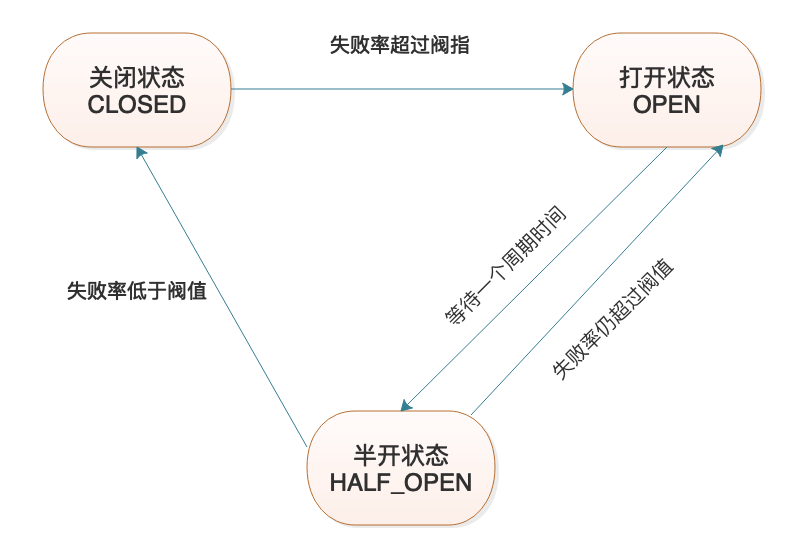
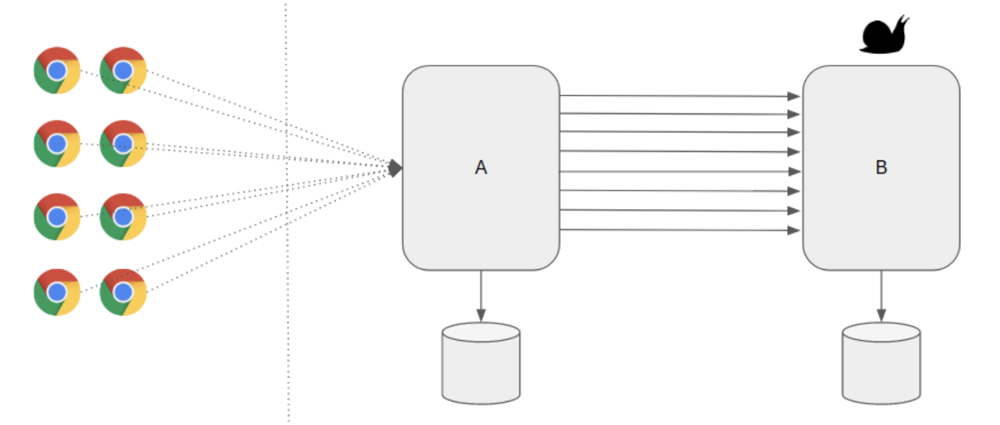
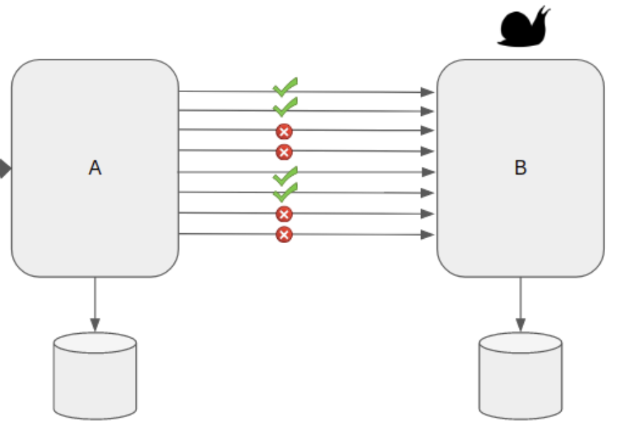
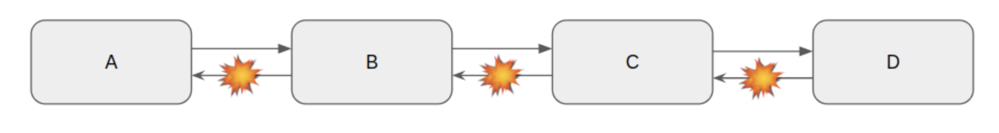
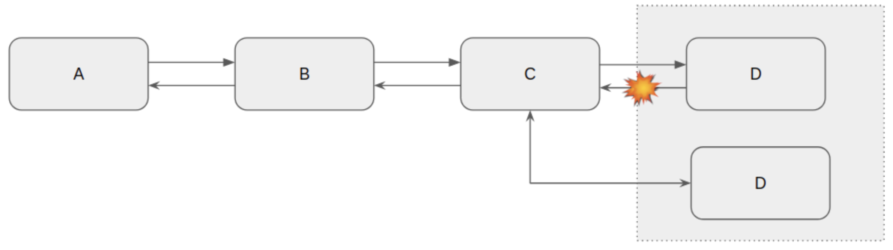

## Resilience4j 指南

### 一. 简介

​	    Resilience4j 是受 Netflix Hystrix 启发的轻量级容错库，但专为Java 8和函数式编程而设计。 轻巧，因为该库仅使用Vavr，而Vavr没有任何其他外部库依赖项。 相比之下，Netflix Hystrix 对 Archaius 具有编译依赖性，而 Archaius 具有更多的外部库依赖性，例如Guava和Apache Commons Configuration。另外，Netflix Hystrix 目前处于维护状态，不在主动开发，SpringCloud 在2020版本后，已经移除了 spring-cloud-netflix 相关模块，容错这块也推荐使用Resilience4j。

​		Resilience4j提供了通过装饰器的方式，以使用断路器，速率限制器，重试或隔板来增强任何功能接口，lambda表达式或方法引用。 您可以在任何功能接口，lambda表达式或方法引用上堆叠多个装饰器来做熔断、限流等动作。

### 二. 原理说明

容错是指系统在部分组件（一个或多个）发生故障时仍能正常运作的能力。要具有这个能力，通常要包含断路器（CircuitBreaker）、并发调用隔离（Bulkhead）、限流（RateLimiter）、重试（Retry）、超时（TimeLimiter 或 Timeout）机制。

- **断路器 — CircuitBreaker**

  断路器一般通过3个有限状态机来实现，CLOSED、OPEN、HALF_OPEN。此外，还有2个特殊的状态机，DISABLED 和 FORCED_OPEN。状态的存储更新必须是线程安全的，即只有一个线程能够在某个时间点更新状态。

  

  - 关闭 —> 打开：当故障率等于或大于可配置的阈值时，CircuitBreaker的状态将从“关闭”更改为“打开”。

  - 打开 —> 半开：当CircuitBreaker打开时，它会拒绝带有CallNotPermittedException的调用。经过一段等待时间后，CircuitBreaker状态从OPEN变为HALF_OPEN，并允许可配置数量的服务调用是否仍然不可用或再次变为可用。用CallNotPermittedException拒绝其他调用，直到所有允许的调用完成。 如果故障率或慢呼叫率等于或大于配置的阈值，则状态会变回OPEN。
  - 半开 —> 关闭：如果故障率和慢呼叫率低于阈值，则状态将变回“已关闭”。

  - DISABLED：始终允许调用。

  - FORCED_OPEN：始终拒绝调用。

  **滑动窗口：**

  ​	断路器使用滑动窗口来存储和汇总调用结果，有两种选择。基于计数的滑动窗口 Count-based 和基于时间的滑动窗口Time-based。

   - 基于计数的滑动窗口

     汇总最近N次调用的结果。

   - 基于时间的滑动窗口

     汇总最近N秒的调用结果。

  **相关配置：**请查看附录 [CircuitBreaker 配置](#CircuitBreaker)。

- **并发调用隔离 — Bulkhead**

  在系统设计中，需要预期故障的发生，将应用程序拆分成多个组件，通过资源隔离确保一个组件的故障不会影响其他的组件。例如：

  ​	**生活：**就像轮船用隔板（Bulkhead）分成多个小隔间，每个隔间都被隔板密封，这样可以防止洪水时整艘船沉没。

  ​	**系统：**两个服务A和服务B，A的某些API依赖B，当服务B运行速度非常慢的时候，A调用B的请求变多时，A的性能会受到影响，服务A中那些不依赖于服务B的功能也无法处理。因此，需要隔离资源专门处理服务A依赖服务B的调用请求。

  并发调用的隔离一般有两种方式来实现：信号量Semaphore 和线程池 ThreadPool。Resilience4j 提供了 SemaphoreBulkhead 和 

  FixedThreadPoolBulkhead 来实现 Bulkhead。

  **相关配置：**请查看附录 [Bulkhead配置](#Bulkhead)。

- **限流 — RateLimiter**

  流量控制是确保服务的高可用性和可靠性的重要技术。流控的场景，服务A依赖服务B，服务A有3个实例，服务B会为了接收到请求做大量的CPU / IO 密集工作，因此服务B在给定的时间范围内设置可以处理的最大请求数的限制。

  

  设置流控后

  

  流控和断路器的区别

  - 流控：速率限制器通过控制吞吐量来帮助保护服务器免于过载。
  - 断路器：当目标服务器出现故障/无响应时，Circuit Breaker有助于保持客户端的安全和正常运行。

  **相关配置：**请参考附录 [RateLimiter配置](#RateLimiter)

- **重试 — Retry**

  微服务体系中，多个服务互相依赖，当被依赖的服务出现问题而无法按预期响应时，就会级联到下游服务，导致不良的用户体验。

  

  同样，在微服务体系中，一个服务会有多个实例，如果其中一个实例可能有问题，并且无法正确响应我们的请求，则如果我们重试该请求，则负载均衡器可以将请求发送到运行状况良好的节点并正确获得响应。通过重试，有更多机会获得正确的响应。

  

  **相关配置：**请参考附录 [Retry配置](#Retry)

- **超时 — Timeout**

  在微服务体系中，服务间相互依赖，例如：A—>B—>C—>D，可能由于某些网络原因，导致被依赖服务D无法按预期响应，这种缓慢会导致下游服务一直到服务A，并且阻塞单个服务中的线程。由于这不是很常见的问题，在设计时需要设置超时来应对服务缓慢/不可用性问题。 

  - 即使依赖服务不可用，也可以使核心服务始终工作
  - 避免无限期的等待
  - 避免阻塞任何线程
  - 使用一些缓存的响应来处理与网络相关的问题并使系统保持运行状态

  **相关配置：**请参考附录 [Timeout配置](#Timeout)

### 三. 使用指南

**引入依赖**

```xml
<dependency>
    <groupId>org.springframework.boot</groupId>
    <artifactId>spring-boot-starter-aop</artifactId>
</dependency>
<dependency>
    <groupId>org.springframework.boot</groupId>
    <artifactId>spring-boot-starter-actuator</artifactId>
</dependency>
<dependency>
    <groupId>io.github.resilience4j</groupId>
    <artifactId>resilience4j-spring-boot2</artifactId>
  <version>${resilience4j.version}</version>
</dependency>
```

#### 1. 重试Retry

- 配置

  服务调用方

  ```yml
  server:
    tomcat: 
      connection-timeout: 15s  ## 设置运行服务器的连接超时时间
  resilience4j:
    retry:
      instances:
        ratingRetryService: 
          max-attempts: 3 ## 最多重试3次
          wait-duration: 2s ## 每次重试调用前，等待3秒
          retry-exceptions:
            - org.springframework.web.client.HttpServerErrorException
          ignore-exceptions:
            - org.springframework.web.client.HttpClientErrorException
  ```

- 代码

  服务提供方，模拟异常

  ```java
  @GetMapping("/rating_random_fail/{productId}")
  public ResponseEntity<ProductRatingDTO> getRatingRandomFail(@PathVariable Integer productId) {
    	ProductRatingDTO productRatingDTO = ratingService.getRatingForProduct(productId);
    	return failRandomly(productRatingDTO);
  }
  	
  /**
   * 模拟服务随机失败
   * 
   * @param productRatingDTO
   * @return
  */
  private ResponseEntity<ProductRatingDTO> failRandomly(ProductRatingDTO productRatingDTO){
      int random = ThreadLocalRandom.current().nextInt(1, 4);
      log.info("[服务端模拟重试场景，数字] -> {}", random);
      if(random < 2){
        return ResponseEntity.status(500).build();
      }else if(random < 3){
        return ResponseEntity.badRequest().build();
      }
      return ResponseEntity.ok(productRatingDTO);
    }
  ```

  服务调用方，重试

  ```java
  private static int retryCount; // 记录重试次数，进行验证
  
  /**
   * 服务端模拟随机失败，客户端实现重试
   * 
   * @param productId
   * @return
  */
  @Retry(name = "ratingRetryService", fallbackMethod = "getDefaultProductRating")
  public CompletionStage<ProductRatingDTO> getProductRatingDto(int productId){
    retryCount++;
    log.info("[重试模拟 {}]，开始调用 {}", retryCount, Instant.now());
    Supplier<ProductRatingDTO> supplier = () ->
      this.restTemplate.getForEntity(this.ratingEndpoint + productId, ProductRatingDTO.class)
      .getBody();
    return CompletableFuture.supplyAsync(supplier);
  }
  	
  /**
  	* 客户端失败回调方法
    * 
    * @param productId
    * @param throwable
    * @return
  */
  private CompletionStage<ProductRatingDTO> getDefaultProductRating(int productId, HttpClientErrorException throwable) {
  		retryCount = 0;
  		log.info("[重试模拟 {} ]，进入回调方法.", retryCount);
  		return CompletableFuture.supplyAsync(() -> ProductRatingDTO.of(0, Collections.emptyList()));
  }
  ```

#### 2. 并发隔板 Bulkhead

- 配置

  服务调用方

  ```yaml
  resilience4j: 
    bulkhead:
      instances:
        ratingBulkheadService: 
          max-concurrent-calls: 5 ## 隔板最大的信号量
          max-wait-duration: 10ms
  ```

- 代码

  服务提供方

  ```java
  /**
  	* 服务提供者 — 模拟服务端处理缓慢
  	* 
  	* @param productId
  	* @return
  	* @throws InterruptedException 
  */
  @GetMapping("/rating_slow_response/{productId}")
  public ResponseEntity<ProductRatingDTO> getRatingSlowResponse(@PathVariable Integer productId) throws InterruptedException {
      TimeUnit.SECONDS.sleep(10L);
      return ResponseEntity.ok(ratingService.getRatingForProduct(productId));
  }
  ```

  服务调用方

  ```java
  /**
  	* 服务端模拟响应缓慢，客户端设置并发隔板
  	* 
  	* @param productId
  	* @return
    */
  @Bulkhead(name = "ratingBulkheadService", type = Type.SEMAPHORE, fallbackMethod = "getDefault")
  public ProductRatingDTO getProductRatingDtoBulkhead(int productId) {
      log.info("[重试并发隔板 {}]，调用开始。", Instant.now());
      ProductRatingDTO productRatingDTO = this.restTemplate
        .getForEntity(this.productEndpoint + "/rating_slow_response/" + productId, ProductRatingDTO.class)
        .getBody();
      log.info("[重试并发隔板 {}]，调用结束。", Instant.now());
      return productRatingDTO;
  }
  
  /**
  	* 客户端失败回调方法
  	* 
  	* @param productId
  	* @param throwable
  	* @return
  */
  private ProductRatingDTO getDefault(int productId, Throwable throwable) {
      log.info("==> 进入回调方法.");
      return ProductRatingDTO.of(0, Collections.emptyList());
  }
  ```

#### 3. 流控RateLimiter 

- 配置

  服务提供方

  ```yaml
  resilience4j:
    ratelimiter:
      instances:
        productRateLimiter: 
          limitForPeriod: 3   ## 每10秒内可用3个
          limitRefreshPeriod: 10s
          timeoutDuration: 0
  ```

- 代码

  服务提供方

  ```java
  /**
  	* 根据 productId 获取商品 — 模拟流量控制
  	* 
  	* @param productId
  	* @return
  */
  @RateLimiter(name = "productRateLimiter", fallbackMethod = "getProductByIdFallback")
  public BaseResponse<ProductDTO> getProductByIdRateLimiter(int productId) {
      ProductPO po = this.map.get(productId);
      ProductDTO productDTO = ProductDTO.of(po.getProductId(), po.getDescription(), po.getPrice(), null);
      return BaseResponse.of(productDTO, ResponseType.SUCCESS, Strings.EMPTY);
  }
  
  private BaseResponse<ProductDTO> getProductByIdFallback(int productId, Throwable throwable) {
    	return BaseResponse.of(null, ResponseType.FAILURE, "当前用户较多，请稍后再试。");
  }
  ```

#### 4. 超时Timeout

- 配置

  服务调用方

  ```yaml
  resilience4j:
  	timelimiter:
      instances:
        ratingTimeoutService: 
          timeout-duration: 3s        ## 3秒超时
          cancel-running-future: true ## 超时后取消正在执行的线程任务
  ```

- 代码

  服务提供方

  ```java
  /**
  	* 服务提供者 — 重试服务端网络抖动
  	* 
  	* @param productId
  	* @return
  	* @throws InterruptedException 
  */
  @GetMapping("/rating_timeout/{productId}")
  public ResponseEntity<ProductRatingDTO> getRatingTimeout(@PathVariable Integer productId) throws InterruptedException {
      int second = ThreadLocalRandom.current().nextInt(1, 5);
      log.info("[服务端模拟超时场景，超时 {} 秒]", second);
      TimeUnit.SECONDS.sleep(second);
      return ResponseEntity.ok(ratingService.getRatingForProduct(productId));
  }
  ```

  服务调用方

  ```java
  /**
  	* 服务端模拟随机失败，客户端实现超时机制
  	* 
  	* @param productId
  	* @return
  */
  @TimeLimiter(name = "ratingTimeoutService", fallbackMethod = "getDefaultTimeout")
  public CompletionStage<ProductRatingDTO> getProductRatingDtoTimeout(int productId) {
      log.info("[超时模拟]，开始调用 {}", Instant.now());
      Supplier<ProductRatingDTO> supplier = () -> this.restTemplate
        .getForEntity(this.productEndpoint + "/rating_timeout/" + productId, ProductRatingDTO.class)
        .getBody();
      return CompletableFuture.supplyAsync(supplier);
  }
  
  /**
  	* 客户端超时回调方法
  	* 
    * @param productId
    * @param throwable
    * @return
  */
  private CompletionStage<ProductRatingDTO> getDefaultTimeout(int productId, Throwable throwable){
      log.info("[超时模拟 {} ]，进入回调方法.");
      return CompletableFuture.supplyAsync(() -> ProductRatingDTO.of(0, Collections.emptyList()));
  }
  ```

#### 5. 熔断CircuitBreak

- 配置

  服务调用方

  ```yaml
  resilience4j:
    circuitbreaker:
      configs:
        default: 
          sliding-window-type: count-based
          sliding-window-size: 100
          permitted-number-of-calls-in-half-open-state: 10  ## 在半开状态时，允许调用的数量
          wait-duration-in-open-state: 10ms                 ## 从打开状态转变为半开状态等待的时间
          failure-rate-threshold: 60                        ## 失败率阀值，百分比
          record-exceptions:
            - org.springframework.web.client.HttpServerErrorException
      instances: 
        ratingCircuitBreakService: 
          base-config: default
  	retry:
      instances:
        ratingCircuitBreakService: 
          max-attempts: 2 ## 最多重试3次
          wait-duration: 1s ## 每次重试调用前，等待2秒
          retry-exceptions:
            - org.springframework.web.client.HttpServerErrorException
          ignore-exceptions:
            - org.springframework.web.client.HttpClientErrorException
  ```

- 代码

  服务提供方

  ```java
  /**
  	* 服务提供者 — 模拟熔断场景
  	* 
  	* @param productId
  	* @return
  	* @throws InterruptedException 
  */
  @GetMapping("/rating_circuit_break/{productId}")
  public ResponseEntity<ProductRatingDTO> getRatingCircuitBreakResponse(@PathVariable Integer productId) throws InterruptedException {
      ProductRatingDTO productRatingDTO = ratingService.getRatingForProduct(productId);
      return circuitBreakFailRandomly(productRatingDTO);
  }
  	
  /**
  	* 模拟熔断场景
  	* 
  	* @param productRatingDto
  	* @return
  	* @throws InterruptedException
  */
  private ResponseEntity<ProductRatingDTO> circuitBreakFailRandomly(ProductRatingDTO productRatingDto) throws InterruptedException {
      // 模拟响应延迟
      TimeUnit.MILLISECONDS.sleep(100L);
      // 模拟响应失败
      int random = ThreadLocalRandom.current().nextInt(1, 4);
      if(random < 3) {
        return ResponseEntity.status(500).build();
      }
      return ResponseEntity.ok(productRatingDto);
  }
  ```

  服务调用方

  ```java
  /**
   * 服务端模拟响应延迟、响应失败，客户端设置熔断机制
   * 
   * @param productId
   * @return
  */
  @Retry(name = "ratingCircuitBreakService", fallbackMethod = "getDefault")
  @CircuitBreaker(name = "ratingCircuitBreakService", fallbackMethod = "getDefault")
  public ProductRatingDTO getProductRatingDtoCircuitBreak(int productId) {
      log.info("[熔断 {}]，调用开始。", Instant.now());
      ProductRatingDTO productRatingDTO = this.restTemplate
        .getForEntity(this.productEndpoint + "/rating_circuit_break/" + productId, ProductRatingDTO.class)
        .getBody();
      log.info("[熔断 {}]，调用结束。", Instant.now());
      return productRatingDTO;
  }
  
  /**
  	* 客户端失败回调方法
  	* 
  	* @param productId
  	* @param throwable
  	* @return
  */
  private ProductRatingDTO getDefault(int productId, Throwable throwable) {
      log.info("==> 进入回调方法.");
      return ProductRatingDTO.of(0, Collections.emptyList());
  }
  ```

### 四. 附录

#### 1. <a id="CircuitBreaker">CircuitBreaker 配置</a>

| 配置项                                            | 默认值      | 说明                                                         |
| ------------------------------------------------- | ----------- | ------------------------------------------------------------ |
| failureRateThreshold                              | 50          | 失败率阀值，百分比                                           |
| slowCallRateThreshold                             | 100         | 慢调用率阀值，百分比，调用时间超过此阀值时，打开熔断         |
| slowCallDurationThreshold                         | 60000 ms    | 调用等待时间，超过此时间时，算作慢调用                       |
| permittedNumberOfCalls<br/>InHalfOpenState        | 10          | 在半开状态时，允许调用的数量                                 |
| maxWaitDurationInHalfOpenState                    | 0           | 半开切换到打开状态前，在半开状态的等待时间<br>0 表示无限等待，直到所有调用完成 |
| slidingWindowType                                 | COUNT_BASED | 滑动窗口的选择。COUNT_BASED 和 TIME_BASED                    |
| slidingWindowSize                                 | 100         | 滑动窗口存储总量                                             |
| minimumNumberOfCalls                              | 100         | 计算失败率的前的最小调用量，例：<br>如果minimumNumberOfCalls为10，则必须至少记录10个调用，然后才能计算失败率。 如果仅记录了9个调用，则即使所有9个调用均失败，CircuitBreaker也不会转换为打开 |
| waitDurationInOpenState                           | 60000 ms    | 从打开状态转变为半开状态等待的时间                           |
| automaticTransition<br/>FromOpenToHalfOpenEnabled | false       | 设置为 true，表示不需要调用即可触发从打开到半打开的转换      |
| recordExceptions                                  | 空值        | 指定会增加故障率的异常<br>默认，所有异常都认为故障，除去 ignoreExceptions<br>，指定列表，列表外的所有异常都认为成功，除去 ignoreExceptions |
| ignoreExceptions                                  | 空值        | 不会视为成功或失败的异常                                     |

#### 2. <a id="Bulkhead">Bulkhead配置</a>

| 配置项             | 默认值                                         | 说明                                                         |
| ------------------ | ---------------------------------------------- | ------------------------------------------------------------ |
| maxConcurrentCalls | 25                                             | 隔板最大的并发执行数                                         |
| maxWaitDuration    | 0                                              | 进入隔板内，线程阻塞的最长时间。0表示一直等待                |
| **线程池配置**     |                                                |                                                              |
| maxThreadPoolSize  | Runtime.getRuntime().availableProcessors()     | 最大的线程池数量，默认服务器线程数                           |
| coreThreadPoolSize | Runtime.getRuntime().availableProcessors() - 1 | 线程池内核数量，默认服务器线程数 - 1                         |
| queueCapacity      | 100                                            | 队列数                                                       |
| keepAliveDuration  | 20 ms                                          | 当线程数大于内核数时，多余的空闲线程将在终止之前等待新任务的最长时间 |

#### 3. <a id="RateLimiter">RateLimiter配置</a>

| 配置项             | 默认值 | 说明                                                         |
| ------------------ | ------ | ------------------------------------------------------------ |
| timeoutDuration    | 5 s    | 请求线程获取调用权限的等待时间                               |
| limitRefreshPeriod | 500 ns | 限制刷新的时间段。 在每个周期之后，<br>RateLimiter 将其权限计数重新设置为limitForPeriod值 |
| limitForPeriod     | 50     | 一个限制刷新期间可用的权限数                                 |

#### 4. <a id="Retry">Retry配置</a>

| 配置项                    | 默认值                        | 说明                                                         |
| ------------------------- | ----------------------------- | ------------------------------------------------------------ |
| maxAttempts               | 3                             | 最大的重试次数                                               |
| waitDuration              | 500 ms                        | 每次重试时等待的时间                                         |
| intervalFunction          | numOfAttempts -> waitDuration | 发生故障后修改等待间隔的功能。 默认情况下，等待时间保持不变。 |
| retryOnResultPredicate    | result -> false               | 设置评估重试的条件，如果评估条件产生的结果为 true，则重试，反之，则不重试 |
| retryOnExceptionPredicate | throwable -> true             | 设置评估重试的异常类，遇到此异常及子类就重试，反之，则不重试 |
| retryExceptions           | 空                            | 配置Throwable类的列表，这类异常记录会重试                    |
| ignoreExceptions          | 空                            | 配置Throwable类的列表，这类异常记录不会重试                  |

#### 5. <a id="Timeout">Timeout配置</a>

| 配置项              | 默认值 | 说明                             |
| ------------------- | ------ | -------------------------------- |
| cancelRunningFuture | 无     | 超时后是否取消当前执行的线程任务 |
| timeoutDuration     | 无     | 多长时间会触发超时               |

### 五. 参考资料

- https://github.com/resilience4j/resilience4j
- https://dzone.com/articles/resilient-microservices-pattern-bulkhead-pattern
- https://www.vinsguru.com/rate-limiter-pattern
- https://www.vinsguru.com/retry-pattern-microservice-design-patterns
- https://www.vinsguru.com/timeout-pattern-microservice-design-patterns/
- https://www.jianshu.com/p/5531b66b777a
- https://resilience4j.readme.io/docs
- https://www.vavr.io